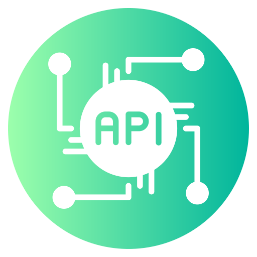

<div align="center">



# JSON+API
</div>


### Import API

```js
import React from 'react'

// Your API
import cardsAPI from './API/card.json'

const App = () => {

    const Card = ({ title, desc }) => {
    return (
      <div className='m-auto'>
        <div className='border-2 border-red-800'> 
          <h2>{title}</h2>
          <p>{desc}</p>
        </div>
      </div>
    )
  }

  return (
      <>
      <div className='flex gap-5'>
        {cardsAPI.map(card => (
          <Card key={card.id} title={card.title} desc={card.desc} />
        ))}
      </div>
    </>
  )
}

export default App
```

---

### [Chat GPT](https://chatgpt.com/share/7530a3b5-2553-4b52-99be-4141aa576ebf)